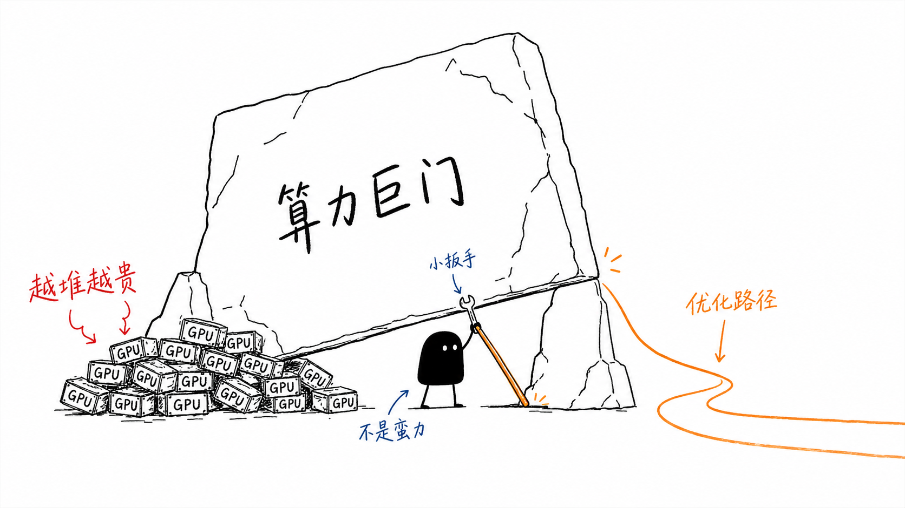
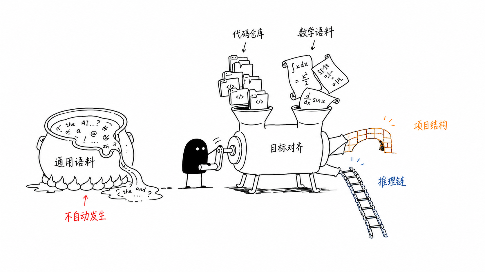
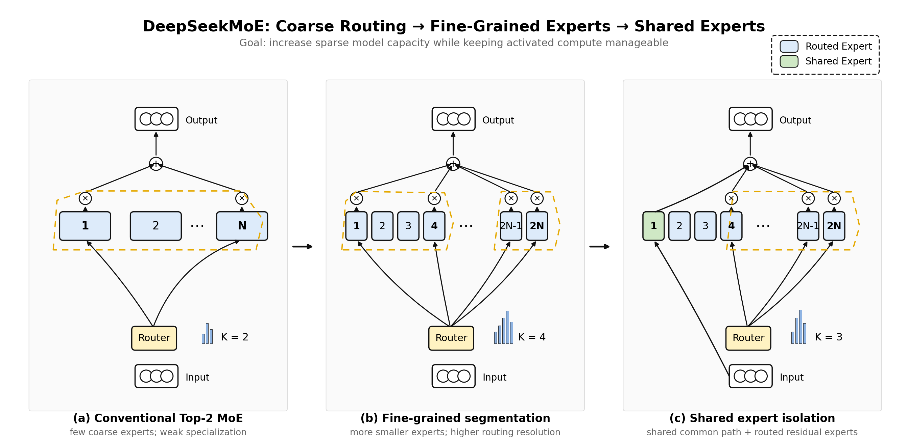

> 原文：[DeepSeek 专题](https://memxlife.github.io/books/mlsys/deepseek.html)
> 说明：忠实翻译原网页内容，并补入与经典文献、业界系统的对照。术语首次出现给出英文锚点。

# DeepSeek 技术路线图：效率护城河

::: tip 本章在体系中的位置
第 8 章讲了 Transformer 基础，第 9、10 章讲了数据并行、模型并行与专家并行，第 11 章讲了 LLM 推理系统（KV cache、GQA/MQA、PagedAttention），第 12 章讲了分布式训练基础设施（FP8 精度、网络、检查点）。那些章节把「大模型系统」的零件一件件摆上了桌。这一章是**集大成**：它把第 10 章的 MoE、第 11 章的 KV cache 与推理优化、第 12 章的 FP8 训练与基础设施，串成一个真实公司（DeepSeek）从 2024 到 2026 的技术路线图。看完这一章，你获得的是此前各章都给不了的视角：**这些技术不是孤立的知识点，而是一场逐轮接力——每个瓶颈被解开，下一个瓶颈立刻顶上。**
:::

过去十年，AI 行业被一条昂贵的共识统治：算力越多，模型越好。前沿实验室把钱砸进由成百上千块 GPU 组成的集群，用电量抵得上一座小城，只为从稠密神经网络里再挤出几个点的指标。通往 AGI 的路，似乎只能用暴力 scaling 铺出来——而这个前提本身，就是资本的准入门槛。

DeepSeek 的技术路线图，是对这套暴力共识的一次刻意偏离。当行业都在造更大的锤子，DeepSeek 在重新思考钉子本身的物理结构。它押注的不是「更多算力」，而是「更聪明的分配」——架构效率与全栈协同设计（full-stack co-design）。这个选择挑战了「多多益善」的叙事，把前沿 AI 的竞争从「谁的集群大」悄悄挪向「谁的单位成本低」。

一家实验室凭什么挑战巨头的 scaling law？不是靠某一次孤立的突破，而是靠一串横跨整个技术栈的创新——从专家怎么组织，到模型怎么训练、怎么服务。把效率当武器，DeepSeek 用**单位经济学（unit economics）**而不是集群规模，筑起了一条护城河。

下面就是这条护城河的完整技术路线图。

## 把路线图读成一段瓶颈接力赛

DeepSeek 的技术路线图，最省力的读法是把它当成一段**瓶颈接力**：每篇论文都瞄准一个具体的约束——当模型在更低的成本下追求更高能力时，这个约束就会从系统里冒出来。按时间顺序，这些约束是：稠密参数激活、薄弱的领域结构、KV cache 膨胀、MoE 训练不稳定、推理轨迹的代价，以及百万 token 的记忆。

这条线的逻辑不是「每代模型都更大」，而是：

- 让容量变稀疏（DeepSeekMoE）；
- 让数据带上领域形状（DeepSeek-Coder / DeepSeekMath）；
- 压缩注意力记忆（DeepSeek-V2 的 MLA）；
- 把经济架构推到前沿规模并稳住训练（DeepSeek-V3）；
- 用可验证的强化学习诱导出推理（DeepSeek-R1）；
- 重新设计长上下文记忆，让推理不被自己的上下文淹没（DeepSeek-V4）。

后面每一节都会回答同一个问题三联：**什么约束在卡脖子？什么机制卸掉了一部分？又留下了什么新约束？**

## 换个视角：三条同时在涨的轴

瓶颈接力是一种读法。另一种更接近系统课语气的读法，是把 DeepSeek 的路线图看成「在控制三条成本轴的同时，尽可能提升有效能力」：

1. **参数/隐容量轴**——模型有多大、每 token 激活多少；
2. **序列/上下文轴**——上下文有多长、历史要存多少；
3. **推理轨迹轴**——一次回答要产生多长的中间过程。

三条轴几乎独立地在涨，DeepSeek 每代模型各掐住其中一条。

SVD 的直觉在这里很有用。一个 Transformer 层，本质上是一堆可学习的线性映射，外加非线性路由、门控、归一化和注意力。对线性映射，把权重矩阵看成 $W = U \Sigma V^\top$ 是一个好用的概念模型：输入与学到的方向做相关，奇异值放大或抑制这些方向，输出在另一组学到的特征基里重建。加宽模型、加大 FFN 维度，就是在增加这些方向的数目和丰富程度——这是**容量 scaling（capacity scaling）**。如果每个 token 无时无刻都激活所有方向，成本就与容量成正比。

DeepSeekMoE 的切入点就在这：不要求每个 token 激活整个参数基，而是把每个 token 路由到一小撮专家。细粒度专家切分提高路由分辨率（routing resolution），共享专家给高频出现的特征留一条公共通路。要注意，这不是对特征空间的硬分解——它不保证公共特征梯度只流向共享专家。更准确的说法是：它是一个**软的架构先验（soft architectural prior）**——让公共结构容易被共享专家学到，把残差型、专门化的部分留给路由专家。

DeepSeek-Coder 和 DeepSeekMath 的主要贡献不是压缩，而是让学到的特征空间对特定领域有用。用 SVD 的话说，它们改变的是奇异方向被训练去代表什么：仓库级代码预训练教的是软件结构特征（函数、API、import、测试、跨文件约定）；数学继续训练和 GRPO 教的是符号与推理导向的方向。容量不是抽象的——只有当数据分布和目标函数把正确的结构暴露出来，表征基才有用。

DeepSeek-V2 引入第二条轴：序列/上下文维度。MLA（Multi-head Latent Attention，多头潜在注意力）压缩的不是 token 数量，而是每个 token 缓存的 KV 表征沿隐/通道维度的宽度。标准注意力为每个 token、每一层存一大份 K/V；MLA 的说法是：多头 K/V 信息大量冗余——每个头的 K/V 向量都来自同一个 hidden state 的投影。与其缓存完整展开的 K/V，不如缓存一个小得多的隐 KV 状态。MoE 稀疏化的是参数/特征变换，MLA 压缩的是注意力逐 token 的记忆表征——两者正交。MoE 降的是激活 FFN 的计算量，MLA 降的是 KV cache 的宽度。两个都需要，因为 LLM 的成本不是一维的。

DeepSeek-V3 接着问：这个经济架构能不能撑到前沿通用模型的规模？它保留 MLA 和 DeepSeekMoE，加入无辅助损失的负载均衡（auxiliary-loss-free load balancing）、多 token 预测（Multi-Token Prediction，MTP）、以及大规模 FP8 训练与系统工程。到这个阶段，DeepSeek 不再发明新的数学 trick，而是在证明：参数轴和 KV 轴上的优化，经得起前沿规模的训练考验。

DeepSeek-R1 加上第三条轴：推理轨迹长度。V3 之后的问题不再是「模型能存多少知识」「长上下文服务多便宜」，而是：模型能不能把**测试时（test-time）**多花的算力变成更好的答案？GRPO 把可验证的结果变成强化信号，不需要 critic 模型。在这个框架里，R1 主要不是压缩隐维度或序列维度，而是优化轨迹维度：更长的推理链、更多的自我检查、更审慎的求解。但这立刻制造出新的系统瓶颈：长推理链和 agentic workflow 产生长上下文、高 KV cache 压力、昂贵的 rollout。

所以 DeepSeek-V4 是自然的下一步。MLA 压缩了每个 token 的 KV 宽度，但仍为每个 token 存一个缓存状态，缓存随序列长度线性增长。V4 把 KV 压缩从隐维度推进到序列维度——通过 CSA/HCA（Compressed Sparse Attention / Heavily Compressed Attention，压缩稀疏注意力 / 重度压缩注意力）。CSA 压缩 token 块并稀疏地选择相关压缩块；HCA 压缩得更狠，在高度压缩后的序列上做稠密注意力。V4 还引入异构 KV cache 管理、磁盘 KV 存储、mHC、Muon、FP4 量化感知训练（QAT）、OPD、rollout 基础设施和沙箱基础设施。

把两条主线合在一起，路线图是这样的：

- **DeepSeekMoE**：用稀疏专家激活控制参数/隐容量。
- **DeepSeek-Coder / DeepSeekMath**：用领域特定的数据和目标函数塑造学到的特征基。
- **DeepSeek-V2**：用 MLA 压缩逐 token 的 KV 记忆，同时用 MoE 保持稀疏容量。
- **DeepSeek-V3**：用负载均衡、MTP、FP8 与系统优化，把经济架构扩展到前沿通用模型。
- **DeepSeek-R1**：用基于 GRPO 的强化学习扩展推理轨迹。
- **DeepSeek-V4**：用 CSA/HCA 与全栈缓存/系统协同设计，控制长推理和 agentic workflow 引起的序列/上下文爆炸。

压缩视角下的核心论点很朴素：DeepSeek 的路线图是一个**资源约束下做能力 scaling 的案例研究**。能力每长一截，瓶颈就沿参数容量 → 领域表征 → KV cache 记忆 → 推理轨迹成本 → 百万 token 上下文系统依次前移，每一代 DeepSeek 瞄准的都是上一代暴露出来的那个主瓶颈。

## 时间线速览

下面的表格按首次公开发表/发布日期排列。对 arXiv 论文，排序用首次提交日期；修订日期仅在影响本地 PDF 时标注。DeepSeek-V4 用的是 Hugging Face 模型卡和技术报告，不是 arXiv 记录。

| 日期 | 论文 | 主要创新 | 解决的问题 | 后续影响 |
|------|------|----------|------------|----------|
| 2024-01-11 | DeepSeekMoE | 细粒度专家切分与共享专家隔离 | 传统 MoE 专家专业化弱、知识混杂、公共知识在专家间冗余 | 成为 V2、V3、Coder-V2、R1、V4 的公共底座 |
| 2024-01-25 | DeepSeek-Coder | 仓库级代码预训练、依赖感知文件排序、FIM、16K 上下文 | 开源代码模型大多停在文件级，项目级生成和填空薄弱 | 代码专家谱系，也是 DeepSeekMath 的基座 |
| 2024-02-05 | DeepSeekMath | 数学语料构建与 GRPO | 开源模型数学落后闭源；PPO 式 RL 要 value/critic 模型，成本高 | GRPO 成为 DeepSeek 后续所有 RL 的核心算法 |
| 2024-05-07 | DeepSeek-V2 | MLA 加 DeepSeekMoE 规模化 | 大模型训练贵、服务贵：稠密计算和 KV cache 都涨得快 | 建立高效通用 MoE 骨干，128K 上下文 |
| 2024-06-17 | DeepSeek-Coder-V2 | 在 V2 上继续预训练代码/数学/自然语言，338 种语言，128K 上下文，代码 RL | 开源代码模型仍落后 GPT-4 Turbo/Claude/Gemini 级代码智能 | 证明 V2 骨干可领域特化而不丢通用能力 |
| 2024-12-27 | DeepSeek-V3 | 无辅助损失负载均衡、MTP、FP8 训练、DualPipe | 前沿规模 MoE 需要更好的负载均衡、更快的训练、更低的内存成本 | 成为 R1 的高性能基座，验证低成本前沿训练 |
| 2025-01-22 | DeepSeek-R1 | 无初始 SFT 的大规模推理 RL，随后多阶段对齐与蒸馏 | 人工 CoT 和 SFT 会限制推理探索；推理模型需要可扩展的 RL | 把 GRPO 变成推理引擎，把推理蒸馏给小模型 |
| 2026 | DeepSeek-V4 | CSA/HCA 混合注意力、mHC、Muon、FP4 专家、细粒度 MoE 推理 kernel | 测试时 scaling 与 agentic 工作负载需要高效的百万 token 上下文 | 把 DeepSeek 从高效 MoE 扩展到高效超长上下文推理与 agent |

---

## 创新 1：DeepSeekMoE——把稀疏容量用对

> 时间线：2024-01-11，[arXiv:2401.06066](https://arxiv.org/abs/2401.06066)。后续影响：V2、V3、Coder-V2、R1、V4 的公共底座。

### 问题：稀疏并不自动等于专业化

先把「稠密 scaling 为什么贵」说清楚。稠密 Transformer 里，每个 token 激活整个模型。要让容量翻倍，就把模型做大——训练和推理成本跟着激活参数量线性涨。**混合专家（Mixture of Experts，MoE）**提供了天然的解法：模型里放很多专家，每个 token 只激活一小撮，总参数与激活参数从此解耦。这也是第 10 章讲专家并行时那个「用稀疏激活换参数量」的老思路。

但传统 top-$K$ MoE 有个没解决的老毛病：**稀疏激活不等于干净的专业化**。如果每个路由专家都又大又粗，单个专家往往要同时装下许多互不相关的知识——它变成一个「迷你稠密模型」，而不是一个专才。另一头，公共知识（基础句法、高频 token 模式、常见语义结构、通用语言建模能力）又在许多路由专家里被重复学习。稀疏容量被这么一浪费，省下的算力就打折扣。

### 直觉：把专家拆细，再留一条公共通道

**直觉。** 一个 token 很少只需要某一种「又大又专」的技能。它常常同时需要句法、局部语义、事实回忆、代码结构、数学模式识别、多语言知识——一次推理往往横跨好几类子技能。粗粒度的大专家被迫把这几种技能捆在一起，路由器只能在几个「大杂烩」之间做选择。如果专家足够细，路由器就可以像拼积木一样，为每个 token 现拼一份专属的组合。

这个想法的第一半是**细粒度专家切分（fine-grained expert segmentation）**：与其选少数几个宽泛的专家，不如造一大批更小的专家，让路由器按需组合。概念的转变是「选少数大专家」→「为每个 token 现配一份子技能混合」。

第二半是**共享专家隔离（shared expert isolation）**：有些知识几乎每个 token 都要——最典型的就是通用的语言建模能力。与其让每个路由专家都各自背一遍，不如单独留几个**始终激活**的共享专家，专门消化这部分高频公共知识。路由专家从此不用再背着「重复学通用知识」的包袱，可以把容量省给长尾、领域化、依赖具体 token 的模式。

### 机制：两个耦合的设计

**关键约束。** 拆细加共享，都要在**激活算力大致不变**的前提下做，否则 MoE 省下的成本又还回去了。

传统 MoE 层里，设模型有 $N$ 个路由专家，每个 token 激活 $K$ 个，每个专家是一个全尺寸 FFN。DeepSeekMoE 把每个传统专家沿 FFN 中间维度切成 $m$ 个，专家池从 $N$ 涨到 $mN$，每个专家约是原来的 $1/m$ 宽。路由器激活 $mK$ 个细专家——激活宽度和逐 token 的 FFN 计算量，与原来的 top-$K$ 基本持平。

MoE 层的输出是三部分之和：残差/token 输入 $u_t$、共享专家的输出、被选中路由专家的门控输出：

$$
h'_t = u_t + \sum_{i=1}^{N_s} \operatorname{FFN}^{(s)}_i(u_t) + \sum_{i=1}^{N_r} g_{i,t}\operatorname{FFN}^{(r)}_i(u_t),
$$

其中 $N_s$ 个共享专家始终激活，$N_r$ 个路由专家构成候选池，门值 $g_{i,t}$ 只对 token $t$ 选中的 top-$K_r$ 个路由专家非零。这一式子里「共享」与「路由」的分工一目了然：前者是稠密的公共通路，后者是稀疏的逐 token 专用容量。

「更多专家」不等于「更多激活计算」。以论文的 2B 验证模型为例：1 个共享专家 + 63 个路由专家，每 token 激活 7 个路由专家，每个专家是标准 FFN 的 0.25 倍。16B 缩放模型：每层 2 个共享 + 64 个路由，每 token 路由 6 个。更早的 145B 预演设定：4 个共享 + 128 个路由，激活 12 个，每个专家只有标准 FFN 的 0.125 倍。

细粒度路由带来一个新风险：**专家坍塌（expert collapse）**——少数专家吃掉大部分 token。论文用两层保险：专家级均衡损失防止单个专家过载；专家跨设备分布时再加设备级均衡损失，防止专家并行造成硬件失衡。有意思的是，16B 模型上专家级均衡因子被调得非常小——在他们的并行策略下，更强的均衡反而伤性能。

训练和验证是分阶段的：先在 2B 规模上把全部 FFN 换成 MoE 层，与 Hash Layer、Switch Transformer、GShard、更大的 GShard 变体、稠密上界基线逐一对比；再训 16B（2T token）并 SFT 出对话模型。消融实验单独测了共享专家隔离、32/64 专家切分、共享/路由比例、关掉 top 路由专家、减少激活专家——正是这些实验支撑了那个论断：DeepSeekMoE 提升的是**专业化**，而不是单纯堆参数。

### 局限：没有硬解耦

**核心局限。** DeepSeekMoE 提高了稀疏容量的可用性，但它不保证干净的专家解耦、完美的负载均衡、或者共享专家与路由专家之间零冗余。

原因很直白：如果一个路由专家对某 token 是激活的，它收到的就是这个 token 的完整 token 级梯度。损失没有被分解成「公共特征损失」和「专用特征损失」——公共特征的梯度照样会更新路由专家，路由专家照样可能学公共知识。共享专家只是给了优化一个**倾向性**，不是一道防火墙：如果路由器反复把通用 token 发给某个路由专家，这个专家照样会变「通用」。只要重复公共特征能降损失，优化就倾向于保留冗余。

细粒度还带来工程成本：更多专家 = 更多路由决策、更多 dispatch 复杂度、更难的负载均衡；路由一旦塌掉，部分专家过劳、部分专家训练不足；专家太细，单个专家又可能容量和数据都不够、学不出稳健的函数。路由分辨率上去了，路由质量的门槛也更高了。

### 引向下一个瓶颈

DeepSeekMoE 让稀疏容量更有用，但它本身是领域无关的——路由对象是通用 token，学到的特征基没有偏向任何领域。下一个瓶颈不再是「怎么路由」，而是「怎么让训练分布把困难领域的结构暴露出来」。这就是 DeepSeek-Coder 把路线图从纯架构效率推进到数据/目标函数设计的转折点。

---

## 创新 2：DeepSeek-Coder——仓库级的代码智能

> 时间线：2024-01-25，[arXiv:2401.14196](https://arxiv.org/abs/2401.14196)。

### 一个类比：背菜谱 vs 掌勺

假设你要把一个人培养成能看懂并补全整个软件项目的人，你会让他怎么学？选项 A：给他看几千条互不相干的代码片段。选项 B：丢给他十几个真实的开源仓库，让他从头到尾读，理解 import 关系、函数怎么被调用、测试怎么约束实现。

直觉上都知道 B 更接近真实开发。但绝大多数开源代码模型当时走的是 A——它们把代码当「一串串 token」来学，而不是当「软件系统」来学。代码不是自然语言：它有严格语法、可执行语义、跨文件的依赖关系。一个符号、函数签名、import、测试断言，可能在几百几千个 token 之外，却决定当前位置该怎么写。只看孤立片段的模型，学得会局部句法和常见惯用法，一碰到跨文件依赖、代码填空、仓库级上下文就露馅。

DeepSeek-Coder 的回答是：把训练单元从「句子」换成「仓库」，把目标函数从「从左到右续写」换成「和程序员真实编辑一致」，把上下文从几 K 拉长到 16K。模型从 1.3B 到 33B 四档，从零开始训 2T token。

### 思路：数据单元、目标、上下文，三处对齐

代码智能在成为一个 agent 问题之前，先是一个**数据和上下文问题**。DeepSeek-Coder 没有在通用模型上做代码指令微调了事，而是通过大规模项目级预训练，把代码能力直接建进基座模型：

1. **数据单元对齐到仓库。** 仓库级数据让模型看到软件的自然结构：定义、import、依赖、测试、注释、文件布局、反复出现的命名约定——而不是被切成一个个孤立的文件。
2. **目标对齐到编辑。** 程序员很少只从左往右追加文本，更多是在已有文件里插入、替换、补全。于是用填空式训练——**Fill-in-the-Middle（FIM）**——让模型在前缀和后缀的夹逼下生成缺失的中间段。这对 IDE 补全、打补丁、局部重构是决定性的。
3. **上下文对齐到工程尺度。** 代码的长程依赖比自然语言强得多。16K 上下文让模型在预训练时就能观察到跨文件的大单元，而不是碎片。

### 实现：一条 2T token 的数据流水线

DeepSeek-Coder 从零训练，语料混合以代码为主：87% 源代码、10% 与代码相关的英文自然语言（GitHub Markdown、StackExchange 等）、3% 与代码无关的中文。源代码覆盖 87 种语言；清洗后约 798GB、6.03 亿个文件。

数据流水线是这篇论文真正花力气的地方：

- **过滤。** 收集 2023 年 2 月前的公开 GitHub 仓库，套用与 StarCoder 同源的规则过滤：平均行超 100 字符、最大行超 1000 字符、字母占比低于 25%、XML 式样板、HTML 可见文本过少、范围外的数据型 JSON/YAML，全部剔除。这一步先把数据砍到原来的 32.8%。
- **仓库级排序。** 用语言相关的正则（Python 的 `import`、C# 的 `using`、C 的 `include`）抽取跨文件调用关系，建文件依赖图，拆掉不连通子图，再跑一个改良拓扑排序——选入度最小的文件以便在有环时也能继续。排好的文件按序拼接成训练样本，每个文件开头插入文件路径注释，让模型知道「这段代码在仓库里的位置」。依赖在前、被依赖方在后，这个顺序是刻意安排的。
- **仓库级去重。** 不去重单个文件，而是把拼接后的整个仓库当一个样本做近似去重——否则文件级去重会删掉个别文件、破坏仓库结构。
- **质量筛选。** 编译器检查 + 质量模型 + 启发式，剔除语法错误、可读性差、模块性弱的代码。

训练目标 = 普通 next-token 预测 + FIM。FIM 把文本随机切成 prefix/middle/suffix，训练模型从两侧上下文重建中间段。论文对比了 PSM 与 SPM 两种变体，消融了 FIM 比例：100% FIM 时 HumanEval-FIM 最好，但普通补全变差，于是取 50% 作为实用折中。

有个细节值得记住：**FIM 不是评估时才用的技巧。** 它在打包之前就改写了预训练样本——文档被切成三段、控制 token 标记空缺、目标序列把缺失段放在两侧之后。填空因此成为基座模型的原生行为，而不是指令微调阶段补学的行为。

### 局限

**核心局限。** DeepSeek-Coder 本质仍是一个**静态代码模型**，不是可执行的软件工程 agent。它从仓库数据里学会了「理解软件结构」，但它没有通过真实编程的循环学习：编辑代码、跑测试、看失败、查错误、改补丁、再试。

这个差距在后来一批可执行编码基准里被照得清清楚楚：[SWE-QA-Pro](https://arxiv.org/abs/2603.16124) 显示 agentic workflow 在长尾仓库上有明显收益，[FeatureBench](https://arxiv.org/abs/2602.10975) 显示即使强 agentic 系统，面向功能的开发仍然困难；[C3-Bench](https://arxiv.org/abs/2601.15879) 强调指令控制的补全、[RepoZero](https://arxiv.org/abs/2605.07122) 测完整仓库复现、[SWE-Bench Mobile](https://arxiv.org/abs/2602.09540) 引入工业移动开发约束（PRD、Figma 设计、Swift/Objective-C、平台测试）。方向是一致的：代码智能最终得走向工具落地、指令跟随、多模态、执行感知。长上下文也不等于长周期软件工程——仓库探索、多文件规划、测试执行、故障诊断、迭代补丁，是另一组能力。

### 引向下一个瓶颈

Coder 证明了数据布局和目标函数能造出领域能力，但它的能力基本是预测性的：补全、填空、生成。下一步要找一个「最终答案能自动验证」的领域——在那里，领域预训练之上还能再叠一层强化学习。数学正是这样的领域。

---

## 创新 3：DeepSeekMath——把数学变成可验证的 RL

> 时间线：2024-02-05，[arXiv:2402.03300](https://arxiv.org/abs/2402.03300)。

### 先看数字

一份从 Common Crawl 里挖出来的数学语料：35.5M 个数学网页、120B token。一个 7B 模型，在代码基座之上继续训练 500B token（56% 数学语料 + 4% AlgebraicStack + 10% arXiv + 20% GitHub 代码 + 10% 中英文自然语言），MATH 基准从零工具、零投票的 **51.7%**，靠 64 样本自一致性（self-consistency）推到 **60.9%**。

这三个数字——120B、7B、51.7%→60.9%——就是 DeepSeekMath 的全部主张：**不用闭源模型的大规模、不用外部符号工具、不用昂贵的人工标注推理链，只靠「挖掘数学数据 + 一个不贵的 RL 算法」，就能把开源 7B 模型的数学推理推到当时闭源模型才有水平附近。**

### 为什么数学特别适合「加一层 RL」

代码预训练给模型的是语法、过程化结构、算法模式；但数学推理需要更具体的东西：在多步之间维持符号约束、正确变换表达式、选对中间引理、沿着一条合法的推理链走到答案。普通 next-token 预测的毛病在于：它不强制推理正确性——模型能模仿解答的「样子」，但一个小错就能毁掉整条链，而 loss 根本看不出来。

数学有一个其它领域少有的性质：**答案可验证（outcome-verifiable）**。开放写作没法自动判断好坏，但数学题通常有明确答案——对错可以自动检查。于是「推理对不对」变成一个能被自动打分的信号，强化学习就有了用武之地：采样多条推理路径，把正确的路径强化、错误的路径压低。

### 思路：数据、基座、RL 三件套

1. **数学数据自己挖。** 现成的精选数学数据集太小，撑不起广泛预训练。DeepSeek 用迭代式 fastText 流水线从 Common Crawl 里挖：先以 OpenWebMath 为高质量种子（50 万正例 + 50 万从 Common Crawl 采的负例），训一个 fastText 分类器（向量维 256、学习率 0.1、词 n-gram 上限 3、最小词频 3、3 个 epoch）。Common Crawl 先按 URL 去重 + 近似去重到约 400 亿 HTML 页，再由分类器打分。挖完一轮，把其中「超 10% 页面被判定为数学相关」的域名挑出来，人工标注域内的数学 URL 路径，加回正例池，再挖一轮。四轮迭代后得到 35.5M 网页、120B token。语料以英文和中文为主，并用「移除与基准精确 10-gram 匹配的页面」来过滤污染。
2. **基座从代码模型出发。** 从 DeepSeek-Coder-Base-v1.5 7B 继续训练，而不是从通用语言模型出发。合理：代码预训练已经给了过程化与符号化的规律（函数、变量、控制流、精确语法、算法分解），和数学共享大量结构，是比纯文本更好的推理基底。
3. **RL 用 GRPO 而不是 PPO。** 标准 PPO 需要一个独立的 critic/value 模型来估计优势——在 7B 规模上又贵又不稳。**GRPO（Group Relative Policy Optimization，组相对策略优化）**改用一个朴素但巧妙的做法：对同一个问题采样一组回答，在**组内**把奖励做相对归一化，估计每个回答的相对优势：

$$
A_i = \frac{r_i - \operatorname{mean}(r_1,\ldots,r_G)}{\operatorname{std}(r_1,\ldots,r_G)}.
$$

PPO 要学一个价值模型来估优势；GRPO 直接用组内奖励分布。这就是省内存、省训练成本的关键动作——论文后来把这套东西用在 V2、Coder-V2、R1、V3、V4 的每一轮 RL 上，成了 DeepSeek 的核心 RL 算法。

### 实现：不是「加一层 RL」这么简单

训练分两个尺度。先用 1.3B 模型在不同数学语料上训 150B token 验证语料质量（AdamW，$\beta_1=0.9$、$\beta_2=0.95$、weight decay 0.1、2000 步 warmup、峰值学习率 $5.3 \times 10^{-4}$、batch 4M token、4K 上下文）；再训主模型 DeepSeekMath-Base 7B：500B token，峰值学习率 $4.2 \times 10^{-4}$、batch 10M token。

继续预训练之后是数学指令微调：混合思维链（chain-of-thought）、程序化思维（program-of-thought）、工具集成推理三类数据，让模型学会多种作答风格——纯自然语言、Python 辅助、工具集成。这就是论文为什么同时评估「无工具」和「Python 辅助」两种解题。

然后才是 GRPO。论文只用了一部分英文指令微调数据做 RL，仍然从 Instruct 版到 RL 版有可测的提升；还把 GRPO 与 RFT、DPO、PPO 对比，研究了在线/离线采样、结果监督/过程监督、迭代式 RL。所以这篇论文的完整配方是：**数据挖掘流水线 + 继续预训练 + 指令微调 + 无 critic 的组相对 RL**——四样东西叠出来的效果。

### 局限

**核心局限。** 它优化的是「最终答案正确」，不是「证明严格」。答案对了不等于推导对——推理链里可能有幸运猜测、非法步骤、隐藏抵消、前后矛盾。这个局限后来被 DeepSeekMath-V2 挑明：仅靠最终答案奖励的 RL 能推高基准分，却保证不了逐步正确。

奖励信号再好也受验证器限制。答案是数字或表达式时好验证；要证明、构造、解释时，最终答案奖励就不够用。[DeepSeek-Prover-V2](https://arxiv.org/abs/2504.21801) 后来转向 Lean 形式化定理证明和子目标分解；[Qwen2.5-Math](https://arxiv.org/abs/2409.12122) 走验证器/模型协同进化；[Kimi k1.5](https://arxiv.org/abs/2501.12599) 把长上下文 RL 当成新的 scaling 轴；Google DeepMind 的 [AlphaProof / AlphaGeometry 2](https://deepmind.google/discover/blog/ai-solves-imo-problems-at-silver-medal-level/) 展示语言模型 + 形式化系统的价值。DeepSeekMath 是一个好用的非形式化数学推理器，但不是证明系统，也不是自动数学发现引擎。

### 引向下一个瓶颈

DeepSeekMath 证明了「可验证领域 + 廉价 RL」能低成本放大推理。但它只是一个 7B 的领域模型。下一个瓶颈是架构级的：怎么把稀疏容量和廉价长上下文推理装进一个足够大的通用模型，让它同时撑起代码、数学和广泛指令跟随。DeepSeek-V2 就是这个融合点。

---

## 创新 4：DeepSeek-V2——稀疏容量 × 便宜长上下文

> 时间线：2024-05-07，[arXiv:2405.04434](https://arxiv.org/abs/2405.04434)。MLA 的原始出处。

### 先算一笔账

稠密模型（比如 DeepSeek 67B）的服务成本有两块大头。第一块是**激活算力**：每个 token 都要过全部参数。第二块是 **KV cache**：自回归解码要为每个 token、每一层缓存一组 key/value，供后续 token 重复读取。第 11 章讲过，KV cache 的显存是

$$
2 \times n_{layers} \times d_{head} \times n_{heads} \times seq\_len
$$

个元素起步——上下文一长，KV cache 比模型本身还大；而解码又受内存带宽约束：每生成一个 token，都要把历史上所有的 K/V 重新读一遍。

MoE 只解决了第一块。DeepSeekMoE 把激活参数降下来之后，KV cache 那部分成本纹丝不动。这就是 DeepSeek-V2 要打的靶子：**同时掐住两块。** 结果是一组著名的数字：与 DeepSeek 67B 相比，训练成本降 42.5%，KV cache 减少 93.3%，最大生成吞吐提升最高 5.76 倍——236B 总参数、每 token 只激活 21B、支持 128K 上下文。

### 核心思路：稀疏容量 + 压缩的注意力状态

DeepSeek-V2 = DeepSeekMoE（解决激活参数问题）+ **MLA（Multi-head Latent Attention，多头潜在注意力）**（解决 KV cache 问题）。

MLA 的思想可以压缩成一句：**K/V 不必以「每个头一份」的完整形态缓存。** 标准 MHA 里，每个注意力头的 K/V 向量都是同一个 hidden state 经过不同投影得到的——大量信息冗余。MLA 先学一个下投影，把 hidden state 压成一个小得多的隐 KV 向量，需要时再靠上投影恢复出各头的 K/V。推理时缓存这个隐向量就够了。

概念上，DeepSeek-V2 是 DeepSeek 从「把模型变大但稀疏」转向「把模型变大、稀疏、且服务得起」的那一步。它不只是一个「更好的模型」——它是一个**围绕服务经济学设计的模型**。

### 实现：MLA 的工程细节

注意力和 FFN 双双重做。FFN 侧沿用 DeepSeekMoE：共享专家始终激活、路由专家 top-$K$ 选择、训练用专家并行；因为 MoE 路由有通信压力，V2 加了**设备受限路由**——一个 token 选中的专家被限制在有限数量的设备上；还有专家级/设备级辅助均衡损失，以及过载时的 token 丢弃策略。

注意力侧是 MLA。标准 MHA 每 token 每层要缓存 $2n_h d_h l$ 个元素（$n_h$ 头数、$d_h$ 每头维度、$l$ 层数）。MLA 先算压缩的隐 KV 向量：

$$
c^{KV}_t = W^{DKV} h_t
$$

再通过上投影重建压缩的 key/value：

$$
k^C_t = W^{UK} c^{KV}_t,\quad v^C_t = W^{UV} c^{KV}_t.
$$

推理时缓存 $c^{KV}_t$ 而非完整的每头 K/V。更妙的是，$W^{UK}$ 可以被吸收进 query 投影、$W^{UV}$ 被吸收进输出投影——推理时根本不需要显式物化每头 K/V。训练侧还加了低秩 query 压缩省激活内存：

$$
c^Q_t = W^{DQ}h_t,\quad q^C_t = W^{UQ}c^Q_t.
$$

这里有一个微妙陷阱：**RoPE**。如果直接把 RoPE 旋到压缩 key 上，位置敏感的旋转会让 key 的上投影无法在推理时吸收进 query 侧。V2 用**解耦 RoPE**解决：内容 key/query 走压缩路径，另外单独生成携带 RoPE 的 query/key 分量并拼回去。于是推理时缓存「隐 KV 向量 + 解耦 RoPE key」两部分，缓存大小正比于 $(d_c + d^R_h)l$，而不是 MHA 的 $2n_h d_h l$。

预训练与对齐的配方：8.1T token 多源语料预训练 → 扩展到 128K 上下文 → 150 万条对话会话对齐（数学、代码、写作、推理、安全等）→ SFT 出对话模型 → GRPO 式 RL 对齐人类偏好。V2-Lite 是 15.7B 总 / 2.4B 激活的轻量版。

### 为什么组合起来特别强

因为 MoE 和 MLA 打的是两条**互相独立又互相放大**的成本轴。解码性能常常被内存带宽卡住，而不是被算力卡住——KV cache 小了，每个 token 要读的历史状态就少，吞吐和批容量立刻上来。这也是为什么后面所有 DeepSeek 模型都把 MLA 当作硬件相关设计而不是单纯注意力变体：它改变了注意力在加速器内存系统上的映射方式。

MLA 的家族位置值得说清楚。第 11 章讲的 **MQA / GQA**（Multi-Query Attention，Shazeer 2019；Grouped-Query Attention，Ainslie 2023）是让多组 query **共享**同一份 K/V，把 KV 显存砍掉一个量级。MLA 走的是另一条路：把 K/V **压进低维隐空间再恢复**。MQA/GQA 压缩的是「头」这个维度，MLA 压缩的是「每头向量」所在的空间——二者互补，MLA 是 2024 年后 DeepSeek 系模型（包括被广泛复刻的 V3）的默认长上下文方案。

### 局限

**核心局限。** V2 把长上下文推理做便宜了，但没解决百万 token。MLA 压缩的是 KV cache 的**宽度**，不是**序列长度**——缓存小了很多，但条目数仍随 token 数线性增长。这正是 V4 后来超越 MLA 的原因：128K 需要宽度压缩，1M 还需要沿序列维做压缩或选择。

MLA 还是一种有损压缩，带实现取舍。它假设历史注意力状态能被紧凑地表征在隐空间——多数时候高效，但需要精确检索、复制、超长程推理的场景可能丢信息。它改变的是硬件平衡而不是移除成本：最优执行策略取决于加速器架构、重计算选择、服务条件。

系统层面 V2 也没走完。V3 后来还要解决专家均衡、训练效率、前沿级稳定性（无辅助损失负载均衡、MTP、FP8/系统优化）。KV cache 小了，但长上下文服务仍需要缓存复用、内存层级、稀疏执行、kernel/运行时协同设计。

### 引向下一个瓶颈

V2 给出了经济的通用骨干：稀疏 FFN（DeepSeekMoE）+ 压缩 KV 宽度（MLA）。骨干一旦到位，路线图分岔成两个问题：同一块基底能不能再特化成代码模型？能不能把它 scale 成前沿通用模型？Coder-V2 回答第一个，V3 回答第二个。

---

## 创新 5：DeepSeek-Coder-V2——给 V2 骨干做领域特化

> 时间线：2024-06-17，[arXiv:2406.11931](https://arxiv.org/abs/2406.11931)。

### 一份配方

DeepSeek-Coder 是从零训的代码模型；Coder-V2 问的是另一个问题：**能不能从 V2 这个现成的经济型骨干出发，只改数据配方和奖励信号，就把它调成一个前沿代码模型，同时不砸掉通用能力？**

配方是这样：**60% 源代码 + 10% 数学 + 30% 自然语言**。代码给编程结构，数学保住推理强度，自然语言防止模型坍缩成狭窄的纯代码分布。做法上不是从零训，而是从一个已训练 4.2T token 的 V2 中间 checkpoint 继续预训练 6T token——总共 10.2T。338 种语言、128K 上下文。RL 阶段用代码/数学专属奖励，但奖励不是直接用编译器 0/1，而是先用编译器反馈训一个奖励模型，再喂给 GRPO。

### 实现：数据规模与关键数字

数据流水线比通用代码爬取具体得多：

- **GitHub 侧**：2023 年 11 月前的公开仓库，套用与 DeepSeek-Coder 相同的规则过滤 + 近似去重 → 821B 源代码 token（338 种语言）+ 185B 代码相关文本 token（Markdown、issue）。再补一轮两迭代 GitHub 检索 → 94B 源代码 token。
- **Common Crawl 侧**：从编码论坛（StackOverflow）、库文档（PyTorch docs）、数学站点（StackExchange）出发，用 DeepSeek-V2 的 BPE tokenizer 训 fastText 分类器，按「域名内超 10% 页面是代码/数学相关」标注、人工标 URL 路径、迭代检索。三轮 → 70B 代码相关 web token + 221B 数学相关 web token。
- 合计新代码语料 1,170B token。训练混合 60/10/30，自然语言部分从 V2 训练数据里采样，确保特化过程中不丢通用指令与语言能力。

两个规模：DeepSeek-Coder-V2-Lite（16B 总 / 2.4B 激活），DeepSeek-Coder-V2（236B 总 / 21B 激活）。训练目标分档：16B 版用 next-token + FIM（PSM 格式，文档级、0.5 比例）；236B 版只 next-token。优化器沿用 V2 风格：AdamW，$\beta_1=0.9$、$\beta_2=0.95$、weight decay 0.1、余弦衰减、2000 步 warmup、衰减到初始学习率的 10%。有个值得记住的稳定性调整：指数归一化导致训练不稳和梯度尖峰，实现回退到常规归一化。

对齐：先造指令集（2 万条代码指令 + 3 万条数学指令，再用通用指令扩充）。RL 用代码/数学 prompt，每个代码 prompt 带对应测试用例。关键决策是**不用编译器通过/失败当直接奖励**——很多 prompt 测试有限，原始 0/1 信号稀疏且可能误导；改为从编译器反馈训奖励模型，给 GRPO 更平滑的引导。

### 为什么能成：不二选一

Coder-V2 没有在「通用智能」和「代码特化」之间做选择。它从一个已有高效容量的通用模型出发，用继续预训练把容量往代码方向偏——比重训一切更省，比浅层指令微调更稳。代码语料改进编程的表征基，数学语料保住算法与符号推理，自然语言保住指令跟随，128K 上下文让仓库级任务更现实。RL 侧延续 DeepSeek 的老策略：**用可验证的领域制造更廉价的强化信号。**

### 局限

**核心局限。** Coder-V2 证明 V2 骨干能被代码特化，但没把代码智能变成完整可执行、工具驱动、长周期的软件工程循环。

测试质量卡着奖励信号：测试不全时「通过」不等于「正确」；奖励模型能比原始 0/1 泛化得好，仍可能继承基准伪影、覆盖率不足、奖励模型误差。它还继承了 V2 架构的长上下文与推理假设：MLA 让 128K 更经济，但百万 token 上下文、缓存层级、长周期 agent 轨迹都还没解决——这些瓶颈后来促成了 R1 的推理轨迹 scaling 和 V4 的长上下文系统重设计。

### 引向下一个瓶颈

Coder-V2 证明 V2 骨干能吃下大块代码/数学继续训练而不坍缩。剩下的问题是**规模纪律**：在数千亿参数尺度上，路由、通信、精度、训练稳定性才是瓶颈。这就是 DeepSeek-V3 的战场。

---

## 创新 6：DeepSeek-V3——把经济架构搬到前沿规模

> 时间线：2024-12-27，[arXiv:2412.19437](https://arxiv.org/abs/2412.19437)。

### 一个工程事实开场

2048 块 H800、14.8T token、671B 总参数、每 token 激活 37B、全程训练 2.788M GPU 小时、无不可恢复的 loss 尖峰。论文声称性能比肩领先闭源模型。这套数字的分量在 2024 年底是震撼的——它意味着前沿规模的大模型训练成本，被压到了多数实验室能想象的数量级。

V2 已经证明「DeepSeekMoE + MLA 让大模型更经济」。V3 的问题不是再发明一个新架构，而是：**这套经济架构能不能一路 scale 到前沿通用模型，同时不丢训练稳定性、负载均衡、推理效率、成本控制？**

### 思路：V2 证明经济架构，V3 证明经济 scaling

V3 的新颖之处不是「又一个 MoE 模型」，而是四个定向改进的叠加：

1. **无辅助损失的负载均衡（auxiliary-loss-free load balancing）**；
2. **多 token 预测（Multi-Token Prediction，MTP）**；
3. **FP8 混合精度训练**；
4. **大规模分布式系统优化**（DualPipe、节点受限路由、通信/计算重叠）。

### 实现：五道工序

**第一道：前沿规模的 MoE。** 沿用 MLA + DeepSeekMoE，但改路由器：对每个 token 算它到各路由专家质心的 sigmoid 亲和度分数，选 top-$K_r$，把选中的亲和度归一化成门值。共享专家仍是始终激活的 FFN 路径。

关键的改动是**无辅助损失负载均衡**。经典做法是用一个不小的辅助损失逼着负载均衡——但它是在和语言建模目标抢优化信号。V3 的做法：给每个专家的亲和度加一个偏置 $b_i$，只影响 top-$K$ 的**选择**，不影响门值：

$$
\text{选择使用 } s_{i,t}+b_i, \qquad \text{门控使用 } s_{i,t}.
$$

每个训练步末，系统看整 batch 的专家负载：过载的专家偏置减一点，欠载的加一点（步长 $\gamma$）。负载均衡从「语义损失」变成了「路由控制机制」——控制器尽可能不掺和语义混合权重。V3 仍保留一个极小的序列级均衡损失，防单序列内极端失衡。另有**节点受限路由**：每个 token 最多发到 $M$ 个节点（按各节点最高亲和度之和选节点），跨节点 MoE 通信从此有界。这套组合下来，V3 训练和推理都不丢 token——很多 MoE 系统里被悄悄吞掉的隐藏成本。

**第二道：MLA 做标准长上下文注意力。** 缓存压缩隐 KV 向量 + 解耦 RoPE key，训练用 query 压缩省激活内存。128K 上下文 + 671B MoE 之所以能共存，靠的就是它。

**第三道：多 token 预测。** next-token 预测相对于语言里的结构量，监督是稀疏的。MTP 在主干之外挂一串顺序模块，各自预测下下个 token。每个模块与主模型共享 embedding 和输出头，把前一深度 hidden state 与未来 token 的 embedding 拼接、投影、过一个 Transformer 块、预测该深度的未来 token。各深度 MTP 损失取平均、乘权重 $\lambda$ 后加进主目标。推理时这些模块可以丢掉，也可以改造成**推测解码（speculative decoding）**。

**第四道：训练系统。** 2048 块 H800，每节点 8 卡 NVLink/NVSwitch 互联、节点间 InfiniBand。并行组合：16 路流水线并行 × 跨 8 节点的 64 路专家并行 × ZeRO-1 数据并行。**DualPipe** 从流水线两端同时调度前向/反向 chunk，把注意力、all-to-all dispatch、MLP 计算、all-to-all combine、流水线通信全部重叠起来。跨节点 all-to-all kernel 与 MoE 路由器和集群拓扑协同设计：token 限最多 4 个目标节点，IB 和 NVLink 传输重叠，只留约 20 个 SM 做通信。

**第五道：内存与精度工程。** 反向传播时重计算 RMSNorm 和 MLA 上投影（不存激活）；EMA 参数异步放 CPU；MTP 的 embedding/输出头与主模型在同一流水线 rank 上物理共享；用 **FP8 混合精度训练**降内存、提吞吐。预训练 14.8T token 后，两阶段扩展上下文：4K 式预训练 → 32K → 128K，再 SFT + RL。所以那 2.788M GPU 小时，是**模型架构 + 路由 + 精度 + 流水线 + 通信 + 内存**协同设计的结果，而不是某一招的功劳。

### 为什么能成

因为它在四条前沿 scaling 的成本线上同时动手：MoE 降容量成本（671B 总参、37B 激活）；MLA 降长上下文推理成本；无辅助损失均衡把负载控制从「语义目标」改回「路由控制」；FP8、通信重叠、专家放置把系统成本压下来。V3 的模型质量与「让模型以可接受成本可训练的训练系统」不可分割——这是一个**模型-系统一体的包**。

### 局限

**核心局限。** V3 把高效 MoE + MLA 架构 scale 成了强通用模型，但没有解决「推理作为 RL 诱导行为」、百万 token 上下文、硬专家解耦、多模态落地、完整训练系统的可移植性。

V3 主要还是通用基座/对话模型，不是推理模型——路线图下一篇论文把这说得最清楚：R1 用大规模 RL 从 V3-Base 里诱出推理行为。如果 V3 已经解决推理，R1 就没必要存在。MTP 改进的是训练信号和局部预测结构，替代不了审慎的问题求解、证明搜索、工具使用、长周期规划。

另外，V3 的效率有部分是系统特定的：2.788M 小时依赖精心调过的 H800 训练栈、低精度 kernel、通信重叠、专家并行基础设施；架构本身不会自动把同样成本剖面移植到别的硬件/软件环境。它也仍以文本为中心——多模态感知、机器人、物理世界交互，没有额外领域适配是解决不了的。

### 引向下一个瓶颈

V3 是前沿规模的基座模型，通用、代码、数学能力都强。但预训练 + 普通对齐不会逼着模型把测试时算力花在搜索、反思、验证上。R1 从 V3-Base 出发，把「潜在能力」变成「通过强化学习学到的推理行为」——这是路线图上一次完全不同的范式切换。

---

## 创新 7：DeepSeek-R1——把能力变成推理行为

> 时间线：2025-01-22，[arXiv:2501.12948](https://arxiv.org/abs/2501.12948)。

### 一个思想实验

假如你手里有个知识、代码、数学都很强的基座模型（比如 V3-Base）。你**不教它怎么推理**——不做任何带思维链的监督微调——直接上强化学习，奖励只看答案对不对。推理行为（长链条、自我检查、回溯）会自己冒出来吗？

DeepSeek-R1-Zero 就是拿这个干净的科学问题做的实验。训练模板只做一件事：要求模型把推理放在 `<think>...</think>`、把最终答案放在 `<answer>...</answer>`，除此之外不施加任何过程约束。答案是：**会。** R1-Zero 发展出了长得惊人的推理链和「啊哈时刻」——训练中后期自己学会反思错误、重试等行为。但代价也很真实：输出可读性差、中英混杂、格式不稳定。

于是 DeepSeek-R1 把方法修到能用：**先用 RL 发现推理，再用监督数据和多阶段对齐把推理收拾得可读、稳定、通用。** 加冷启动数据、语言一致性奖励、合成推理数据、非推理数据、规则+模型混合的最终 RL 阶段。

### 为什么「用 RL 诱导推理」这个思路成立

预训练教模型预测「最可能的下文」，SFT 教它模仿「好看的回复格式」，RL 推它生成「能拿到奖励的轨迹」。如果更长的探索、回溯、验证、自我修正能提高奖励，这些行为就会被强化——推理行为**从奖励优化里涌现**，而不是从监督样本里复制。前提是奖励可用：数学和代码领域恰恰如此——答案对不对能自动检查，程序跑不跑得过测试能自动判断，模型不需要人类标每步。

GRPO 在这里不是细节，是**成本使能器**：单独的价值模型在大规模下又贵又不稳；组内相对奖励只要「在同一个 prompt 的采样结果之间分高下」，不需要对每个部分状态估绝对价值。这让实验在 V3 这样的规模上做得起。

### 实现：R1-Zero → R1

**R1-Zero 的关键参数。** 学习率 $3 \times 10^{-6}$、KL 系数 0.001、采样温度 1、每题 16 个输出、最大 rollout 长度在 step 8.2K 前为 32,768 token、之后 65,536、共 10,400 步、每步 32 个不同问题、batch 512；每 400 步把参考模型换成最新策略；每次 rollout 生成 8,192 个输出、拆 16 个 mini-batch、训一个内层 epoch。奖励设计刻意基于规则：数学看 boxed 答案、代码看编译器/测试用例、逻辑类看规则可验证答案；再加格式奖励逼 `<think>`/`<answer>` 标签。论文给准确率与格式奖励同权，且明确**不用神经奖励模型**——大规模 RL 里它们容易被 reward hacking。

**R1 的多阶段流水线。**

1. 收集数千条冷启动样本（对话式、人类对齐的长 CoT），对 V3-Base 做 SFT；
2. 第一轮 GRPO：推理 prompt，加语言一致性奖励（思维链中目标语言词的占比）治中英混杂；其余设置沿用 R1-Zero；
3. 拒绝采样 + 再 SFT：采样推理输出、过滤精炼，与 V3 式 SFT 的非推理数据（写作、事实问答、通用指令）混合——模型因此不只是数学/代码推理器，还是通用助手；
4. 第二轮 RL：推理 prompt 继续用规则奖励；通用 prompt 用 helpfulness 奖励模型（66K 偏好对，DeepSeek-V3 评判）+ safety 奖励模型（106K 安全/不安全标注）+ 格式奖励。温度降到 0.7，跑 1,700 步，通用偏好奖励只在最后 400 步引入，压制 reward hacking。

发布还包括蒸馏：更小的稠密模型从 Qwen、Llama checkpoint 初始化，在 R1 生成的推理数据上训练——它们不走完整的大规模 RL 流水线，靠监督蒸馏继承推理行为。

### 局限

**核心局限。** R1 证明 RL 能从强基座里诱出推理行为，但没解决忠实推理验证、奖励泛化、推理长度控制、安全、多模态/工具落地、测试时算力的最优分配。

结果奖励不保证推理忠实——答案对不代表中间步骤对，模型可能靠幸运猜测、隐藏捷径、基准特定模式过关。这和 DeepSeekMath-V2 强调的是同一个问题：答案级成功 ≠ 证明级正确。开放式推理（科学论证、法律分析、策略规划）很难在不引入奖励模型误差或 reward hacking 的前提下给奖励。

推理也需要「刹车」。更多思考不总是更好：[DeepSeek-R1 Thoughtology](https://arxiv.org/abs/2504.07128) 找到「甜点区」——额外推理时间超过某点反而伤性能，还报告了 R1 会在早期问题表述上反复沉思。R1 类模型既要学会思考，也要学会**何时停、何时改、何时换策略**——R1 论文自己用 R1-Zero vs R1 的对比点明了这一点。

更广的边界也在被别的系统划出：[OpenAI 的 o3/o4-mini](https://openai.com/index/introducing-o3-and-o4-mini/) 强调带图像和工具的推理；[Qwen3](https://arxiv.org/abs/2505.09388) 引入思考/非思考模式和思考预算机制；[s1](https://arxiv.org/abs/2501.19393) 显示精选轨迹 + 预算强制也能做出测试时 scaling。推理的安全、验证、工具使用、测试时算力分配，R1 都不是终局答案。

### 引向下一个瓶颈

R1 把 V3 变成了推理模型，但**推理长度成了系统问题**。长 CoT、工具轨迹、代码编辑历史、检索结果、rollout 数据全在膨胀上下文。这股压力正戳在 MLA 的软肋上：它压缩 KV 宽度，但仍为每个 token 存一个状态。V4 瞄准的就是推理的序列长度和缓存管理这一侧。

---

## 创新 8：DeepSeek-V4——让长周期智能可运作

> 时间线：2026 预览版。以 Hugging Face 模型卡与技术报告为准（V4-Pro / V4-Flash），非 arXiv 记录。

### 三个数字

1M token 上下文下，V4-Pro（1.6T 总参数 / 49B 激活）只用 DeepSeek-V3.2 单 token 推理 FLOPs 的 **27%**、KV cache 的 **10%**；V4-Flash（284B 总 / 13B 激活）只用 **10%** FLOPs、**7%** KV cache。

这三个数字的潜台词是：R1 之后 DeepSeek 撞到的墙，不是「能不能推理」，而是「**长推理值不值得做**」。长思维链、工具历史、搜索轨迹、代码编辑历史、大文档分析——全是长上下文。如果模型要反复对几十万上百万 token 做注意力，限制因素不再是参数和训练数据，而是注意力计算、KV cache 存储、内存带宽、缓存复用、rollout 基础设施。

V2/V3 的 MLA 主要压缩逐 token 的 KV 宽度——强大，但缓存条目数仍随 token 数线性涨。V4 打的下一个瓶颈是**序列长度本身**。它把「长周期智能」当作模型-内存-kernel-训练-推理-agent-基础设施的整体问题来解，而不是模型架构一个层面的问题。

### 思路：全栈长上下文协同设计

V4 的模型级核心是用**混合压缩注意力**取代 V2/V3 式的长上下文方案：**CSA（Compressed Sparse Attention，压缩稀疏注意力）** + **HCA（Heavily Compressed Attention，重度压缩注意力）**。CSA 对压缩后的历史块做选择性（稀疏）访问；HCA 提供一条极廉价的全局压缩通路。残差/优化层加 mHC（Manifold-Constrained Hyper-Connections）和 Muon；系统层加融合专家并行 kernel、TileLang、确定性/批量不变 kernel、上下文并行、异构 KV cache 布局、磁盘 KV cache 复用；后训练层加专家训练 + 多教师 On-Policy Distillation（OPD）、FP4 量化感知训练、推理模式、DSML 工具调用、Quick Instruction token、容错 rollout、DSec 沙箱。

### 实现要点

- **CSA**：每 $m=4$ 个 token 压成一个压缩 KV 条目，通过 Lightning Indexer 做稀疏 top-k 检索（V4-Pro $k=1024$，V4-Flash $k=512$），主注意力只跑在被选中的子集上。
- **HCA**：$m'=128$ 个 token 压成一个条目，压缩后序列极短，不需要 top-k，直接做稠密注意力——廉价的全局记忆通路。
- **滑动窗口分支**：CSA/HCA 都是有损的，V4 给最近 $n_{\mathrm{win}}=128$ 个 token 留一条未压缩的精确注意力分支。
- **mHC**：把残差映射矩阵投影到 Birkhoff 多面体（Sinkhorn-Knopp），保证残差变换非扩张，防止多通道残差流的信号爆炸。
- **Muon**：通过混合 Newton-Schulz 迭代近似正交化更新矩阵，改善万亿参数 MoE 训练的收敛与稳定；embedding、预测头、RMSNorm 权重、部分 mHC 参数仍用 AdamW。
- **系统**：专家分波次，一波通信与另一波计算重叠——报告通用推理 1.50×–1.73× 加速、RL rollout 与高速 agent 服务等延迟敏感场景最高 1.96×。TileLang 做融合 kernel，强调确定性、批量不变、张量级 checkpointing、上下文并行、定制 KV cache 布局、磁盘 KV cache 共享前缀复用。
- **后训练**：领域专家训练 + 多教师 On-Policy Distillation 整合；FP4 量化感知训练覆盖 MoE 专家权重和 CSA indexer QK 通路；三种推理模式、XML 式 DSML 工具调用、交错思考、Quick Instruction token、DSec 沙箱支撑大规模 agentic 训练与评估。

### 局限

**核心局限。** V4 让百万 token 长周期智能大大更可运作，但没完全解决信息丢失风险、忠实推理、系统可移植性、架构简单性、与最强闭源模型的全任务对等。

V4 的优势就是它的负担：太复杂。CSA、HCA、滑动窗口、mHC、Muon、FP4 QAT、融合 kernel、上下文并行、异构 KV cache、磁盘缓存、OPD、rollout、沙箱——互相纠缠，难推理、难复现、难干净消融、难移植。V4 报告自己承认了这点，说未来要尝试把设计蒸馏成更核心的组件。

压缩风险是第二道坎。CSA/HCA 假设长历史多数时候能被压缩而不丢关键信息——合理，但不是保证。精确检索、复制、罕见事实、形式化依赖、代码库引用、对抗性放置的信息可能需要高分辨率记忆。一个模型接受了一百万 token，仍可能在检索质量、规划连贯性、全局一致性上退化。**百万 token 上下文 ≠ 百万 token 推理。** 另外要诚实标注一点：Reuters 报道了 V4-Pro API 永久降价 75%，但 DeepSeek 未披露是否与华为昇腾 950 供应增加有关——定价归定价，架构与基准对比以技术报告/模型卡为准。

### 引向下一个瓶颈

V4 把路线图从「更多地推理」推向「让长推理可运作」。开放问题不再是「百万 token 上下文能否更便宜」，而是：压缩之下有多少精确信息存活？kernel/缓存栈有多可移植？agentic 推理在这个规模上能被多可靠地验证？

---

## 技术深潜：CSA/HCA 多分辨率记忆

DeepSeek-V4 想解决的核心问题，不是「怎么把上下文窗口弄得更长」。一个长上下文窗口，只有当模型负担得起「存储、读取、关注其中的历史信息」时才有用。标准 Transformer 里，每个历史 token 都往 KV cache 里放一份 key/value；自回归解码时，每个新 token 都要跟这段不断增长的历史互动。上下文长度是 $T$，历史记忆就随 $T$ 线性涨。MLA 压缩了每 token 的隐宽度，但仍然每历史 token 留一个记忆条目。CSA 和 HCA 走得更远——**它们压缩序列维度本身**：若干个 token 被融成一个学出来的压缩记忆条目。这就是从 V2/V3 到 V4 的本质转变。

理解 V4 注意力最顺的方式，是把它当成一个**多分辨率记忆系统**。最近的 token 保持高分辨率，因为精确的局部语法、格式化、变量名、紧邻的推理步骤都很重要；远处的 token 用压缩记忆条目表示，因为大部分长程上下文不需要对每个未来 query 都以全 token 精度访问。CSA 提供中等压缩、按 query 检索的记忆；HCA 提供重度压缩、稠密覆盖的全局记忆；滑动窗口分支保住精确的最近上下文。这不是对「完美记忆」的硬保证，而是一个**学出来的、有损的、多分辨率的近似**——由 next-token 预测和后训练目标端到端训练而成。

从 Transformer 某层的 hidden state 序列开始：

$$
H =
\begin{bmatrix}
h_0 \\
h_1 \\
\vdots \\
h_{n-1}
\end{bmatrix}
\in \mathbb{R}^{n \times d},
\qquad h_j \in \mathbb{R}^{d}.
$$

这里 $n$ 是序列长度，$d$ 是隐维度。普通注意力把 $H$ 投影成 key/value 并全存下来。CSA 的做法不同：它先生成内容向量和压缩分数向量。内容向量是「可能存活进压缩记忆」的信息；分数向量决定每个 token、每个通道对压缩条目的贡献强度。

对 CSA，V4 用两个内容流：

$$
C^a = H W^a_{KV}, \qquad C^b = H W^b_{KV}, \qquad W^a_{KV}, W^b_{KV} \in \mathbb{R}^{d \times c}.
$$

对 token $j$，也就是：

$$
C^a_j = h_j W^a_{KV}, \qquad C^b_j = h_j W^b_{KV}, \qquad C^a_j, C^b_j \in \mathbb{R}^{c}.
$$

这两个流不是普通的注意力头，而是 token 贡献给相邻压缩条目的两种途径。如果序列被简单地切成不重叠的四 token 块，跨边界的短语、代码表达式或推理单元就可能被割裂。V4 让每个 CSA 压缩条目**同时从当前块和前一块取材**：一个流让 token 贡献到压缩边界的一侧，另一个流让它贡献到相邻条目。这样压缩是有重叠的，同时仍然每 $m$ 个 token 产出一个条目。

分数流同理：

$$
Z^a = H W^a_Z, \qquad Z^b = H W^b_Z, \qquad W^a_Z, W^b_Z \in \mathbb{R}^{d \times c}.
$$

对 token $j$：

$$
Z^a_j = h_j W^a_Z, \qquad Z^b_j = h_j W^b_Z, \qquad Z^a_j, Z^b_j \in \mathbb{R}^{c}.
$$

$Z$ 向量不作为记忆内容存储，它们是被用来产生压缩权重的 logit。细节在这里：$Z$、$S$、$C$ 都有通道维度 $c$。压缩不是「每个 token 一个标量重要度分数」，而是**逐通道的混合决策**——压缩向量的不同维度可以从不同的源 token 里取材。这比平均池化或标量打分更有表现力。

V4 用 CSA 块大小 $m = 4$。对压缩条目 $i$，当前块是：

$$
B_i = \{mi, mi+1, \ldots, m(i+1)-1\},
$$

前一块是：

$$
B_{i-1} = \{m(i-1), m(i-1)+1, \ldots, mi-1\}.
$$

CSA 用当前块的 $C^a$ 和前一块的 $C^b$ 来形成条目 $i$。混合内容之前，先把 $Z$ logit 转成归一化权重：拼接当前块的 $Z^a$ 与前一块的 $Z^b$，加上可学习的位置偏置，对 $2m$ 个候选 token 位置按通道做 softmax：

$$
\left[
S^a_{mi:m(i+1)-1};
S^b_{m(i-1):mi-1}
\right]
=
\operatorname{Softmax}_{\mathrm{row}}
\left(
\left[
Z^a_{mi:m(i+1)-1} + B^a;
Z^b_{m(i-1):mi-1} + B^b
\right]
\right).
$$

这就是 CSA 压缩的心脏。$Z$ 是未归一化的压缩 logit；$B^a$、$B^b$ 注入局部位置信息——token 在压缩窗口内的位置是有意义的；softmax 把 logit 变成 $S$，即归一化混合权重。权重决定每个通道从哪些 token 位置上取材。

CSA 随后形成压缩内容向量：

$$
C^{\mathrm{Comp}}_i
=
\sum_{j=mi}^{m(i+1)-1} S^a_j \odot C^a_j
+
\sum_{j=m(i-1)}^{mi-1} S^b_j \odot C^b_j.
$$

乘法 $\odot$ 是逐元素的。如果 $S_j$ 是标量，token $j$ 要么整体强贡献、要么整体弱贡献；但 $S_j \in \mathbb{R}^{c}$，token $j$ 可以对某些特征通道贡献强、对另一些贡献弱。一个数字 token 可能主导数值通道，一个变量名可能主导标识符通道，一个结构 token 可能主导语法/格式通道。压缩器不是简单决定「哪些 token 活下来」，而是在学习「如何在一个局部压缩窗口里，把特征通道分配给不同的 token」。

对 $m = 4$，条目 $i$ 从八个候选 token 表征算出来：四个来自前一块（$b$ 流）、四个来自当前块（$a$ 流）。但条目仍然是每四个 token 产出一个，因为相邻条目有重叠——所以压缩比约 $4\times$，而不是 $8\times$。重叠设计在不过度削减条目数的同时，减少了边界伪影。

到这里，CSA 已经把序列从 $n$ 个 token 级 KV 条目减到约 $n/m$ 个压缩条目。$m=4$ 时，一百万个 token 仍有约 250,000 个压缩条目——比一百万小多了，但对每个解码步做稠密注意力还是太大。CSA 用 **Lightning Indexer** 补上稀疏检索。

Lightning Indexer 从历史压缩块创建压缩 indexer key，从当前 token 创建 query 侧 indexer 表征。对当前 query token $t$，它算 query 与每个历史压缩块的分数：

$$
I_{t,s} = \operatorname{score}\left(q^I_t, K^{I,\mathrm{Comp}}_s\right).
$$

论文实际用的分数涉及多个 indexer query 头、可学习的头权重、ReLU 变换的点积；功能含义就是：$I_{t,s}$ 估计压缩块 $s$ 对 token $t$ 是否相关。CSA 然后选 top-$k$ 压缩条目：

$$
\mathcal{S}_t = \operatorname{TopK}(I_{t,:}).
$$

V4-Pro 取 $k = 1024$，V4-Flash 取 $k = 512$。也就是说 CSA 不在 25 万个压缩条目上跑主注意力，而是先检索一个依赖 query 的子集，再只在这个子集上做注意力：

$$
\operatorname{CSA}(t)
=
\operatorname{Attn}
\left(
q_t,
\left\{C^{\mathrm{Comp}}_s \mid s \in \mathcal{S}_t\right\}
\right).
$$

「压缩稀疏注意力」这个名字由此而来：压缩，因为 token 块被合并成条目；稀疏，因为 query 只关注 top-k 条目而不是全部。压缩缩短了记忆长度，稀疏检索削减了注意力计算。

HCA 更简单。同一个可学习块压缩思想，但压缩比大得多：不用 $m=4$，用 $m'=128$。投影也简化为单内容流 + 单 logit 流：

$$
C = H W_{KV}, \qquad Z = H W_Z.
$$

对每个 128-token 块，HCA 把 $Z$ 转成 softmax 权重，组合内容向量：

$$
S_{m'i:m'(i+1)-1}
=
\operatorname{Softmax}_{\mathrm{row}}
\left(
Z_{m'i:m'(i+1)-1} + B
\right),
$$

$$
C^{\mathrm{Comp}}_i
=
\sum_{j=m'i}^{m'(i+1)-1} S_j \odot C_j.
$$

$m'=128$ 时，一百万个 token 只剩约 7,812 个压缩条目：

$$
\frac{1{,}000{,}000}{128} \approx 7{,}812.
$$

压缩后的序列短到这个程度，HCA 不需要 top-k 稀疏检索，可以对所有重度压缩条目做稠密注意力：

$$
\operatorname{HCA}(t)
=
\operatorname{Attn}
\left(
q_t,
\left\{
C^{\mathrm{Comp}}_0,
C^{\mathrm{Comp}}_1,
\ldots,
C^{\mathrm{Comp}}_{\lfloor n/m' \rfloor}
\right\}
\right).
$$

CSA 和 HCA 的区别是**用保真度换成本**的方式不同：CSA 中等压缩 + 稀疏检索，适合「相对具体的远处信息」；HCA 激进压缩 + 稠密注意力，适合「低分辨率的全局上下文」。有一句要说得精确：不要把 HCA 描述成有保证的「主题记忆」——论文没证明这一点。更准确的表述是：128 个 token 压进一个向量，天然留不下所有 token 级细节，它在结构上偏向粗粒度的聚合信息。

滑动窗口分支是必须的，因为 CSA 和 HCA 都是有损的。最近的上下文往往需要精确记忆——下一个 token 可能依赖紧邻的句法、标点、变量名、缩进、局部推理步骤。V4 加一条局部未压缩注意力分支，窗口 $n_{\mathrm{win}} = 128$：对最近 token 精确关注，对远处 token 用压缩记忆：

$$
O_t = O^{\mathrm{local}}_t + O^{\mathrm{compressed}}_t.
$$

论文实现里还包括共享 key-value 的 MQA 式注意力、分组输出投影、部分 RoPE 处理、query/KV 归一化、注意力 sink——实际层比这个简单求和复杂得多。但记忆层级被这个表达式抓住了：局部精确注意力提供高分辨率近期上下文，CSA/HCA 提供压缩的长程上下文。

值得辩护的假设不是「填充词可以被删掉」，而是：**并非所有历史 token 状态，都需要对每个未来 query 以同等分辨率呈现。** 在语言、代码、文档、推理链里，精确的局部上下文极其重要，远处的上下文往往通过选定区域或聚合状态起作用。CSA/HCA 把这个假设直接编码进架构：CSA 保留中等压缩的记忆并让每个 query 检索相关块，HCA 保留重度压缩的全局路径，滑动窗口保住精确局部依赖。

这种可学习压缩是合理的，因为它是端到端训练的。压缩权重不是人类熵检测器选的：模型在 next-token 预测和后训练目标下学出 $W_{KV}$、$W_Z$、位置偏置、indexer 投影、注意力投影。如果压缩破坏了预测需要的信息，损失会推动模型改变「往 $C$ 里写什么、用 $Z$ 怎么打分、靠 Lightning Indexer 怎么检索」。压缩器是一个学出来的记忆写入机制。

效率的故事到这里很清楚。MLA 压缩每个 token 缓存状态的宽度：

$$
T \cdot d_{KV} \longrightarrow T \cdot d_{\mathrm{latent}}.
$$

CSA/HCA 攻击的是 $T$ 本身：

$$
T \longrightarrow \frac{T}{m}, \qquad T \longrightarrow \frac{T}{m'}.
$$

CSA 还把核心注意力集合进一步缩小：

$$
\frac{T}{m} \longrightarrow k.
$$

这就是 V4 能瞄准百万 token 的原因。报告称在 1M 上下文时，V4-Pro 只花 V3.2 单 token 推理 FLOPs 的 27%、KV cache 的 10%；V4-Flash 只花 10% FLOPs、7% KV cache。

局限同样重要。CSA/HCA 有损，不保证每个远处的事实、数字、变量、表格单元、证明依赖、精确引文都活过压缩。CSA 可能在「压缩表征丢了关键信息」或「Lightning Indexer 选错块」时失败；HCA 可能在「128 个 token 里有多个互不相同的事实、塞不进一个向量」时失败。这个架构不是完美的百万 token 记忆，而是一个用保真度换成本的**学出来的多分辨率近似**。

干净的解读：V4 用学出来的多分辨率记忆取代了均匀的历史记忆。滑动窗口让最近 token 精确；CSA 把小段重叠 token 区写进压缩条目，为每个 query 检索最相关的那些；HCA 把大段 token 写进重度压缩条目，给模型一条廉价稠密的全局通路。这个设计打的正是百万 token 的真瓶颈——不只是 KV cache 的宽度，而是**必须存储和读取的历史状态数量**。远处上下文能压缩、能按块检索时，它成立；远处上下文的精确 token 级保真度必不可少时，它失效。

---

## 技术侧栏：超越加法恒等式——Moonshot AttnRes 与 DeepSeek mHC

十多年来，残差连接 $x_{l+1} = x_l + F(x_l)$ 一直是深度学习的地基。ResNet 把它发扬光大，Transformer 继承下来：这个简单的加法防止梯度消失，让网络能堆到几百层。

但当 LLM 走向万亿参数 MoE、极端深度、百万 token 上下文，经典残差流开始像一个结构瓶颈。一个 $d$ 维向量能承载的信息有限。深层不断把新变换倒进同一个「数学桶」里，早期层的特征会被稀释、覆盖，或在数值上难以取回。

2026 年的两条架构路线从正交的几何角度攻这个问题：Moonshot AI 的注意力残差（AttnRes）和 DeepSeek-V4 的流形约束超连接（mHC）。两者都越过被动的加法积累，走向主动的结构化路由，但路由方向完全不同。

### Moonshot 注意力残差：选择性的搜索引擎

[Moonshot 的 Attention Residuals](https://arxiv.org/abs/2603.15031) 解决论文所称的 **PreNorm 稀释**。深层 PreNorm Transformer 里，后面的层可能需要很早就提取的原始句法或 token 特征。标准残差积累下，这些早期特征被混进不断增长的后续输出流；要让早期特征在深层「被听见」，后续层得发出越来越大的输出，造成幅度增长和梯度分布不均。

AttnRes 把深度轴变成动态数据库。每层不再盲目继承上一层残差流，而是学一个伪 query 向量，在历史层输出上算 softmax 注意力分布：

$$
h_l = \sum_i \alpha_{i \to l} \cdot v_i.
$$

$\alpha_{i \to l}$ 是分配给过去层 $i$ 的归一化相关性权重。直觉简单：AttnRes 像一台在深度上运行的按需检索引擎。如果第 80 层需要第 3 层提取的原始特征，它不必赌这个特征能活过 4 到 79 层的累积噪声——直接给第 3 层打高分、取回那份历史表征。

代价是朴素 AttnRes 会增加激活内存和通信——深层可能需要访问很多先前层输出。Moonshot 用 Block AttnRes 把层分组，让回溯窗口有界，激活缓存开销可控。

### DeepSeek mHC：多车道高速路

Moonshot 沿深度向后看，DeepSeek 沿宽度向外看。标准残差流把通信限制在一条 $d$ 维车道上；**Hyper-Connections** 把这条路扩成多条并行残差流，信息可以走若干通道，而不是被挤进一个向量。

危险在于不稳定。如果每层用一个无约束的可学习矩阵自由混合并行流，微小的数值不平衡会随深度乘性地累积：信号方差爆炸、梯度 blow up，多车道残差结构直接训不动。

mHC 用 **Sinkhorn-Knopp** 算法把残差混合矩阵投影到 **Birkhoff 多面体**上。实操上，路由矩阵被强制为双随机：每行每列之和都是 1。双随机矩阵的乘积仍是双随机矩阵，所以跨很多层的复合特征路由映射保持质量守恒：

$$
P_{i \to L} = \prod_j H_{\mathrm{res}}^{(j)}.
$$

直觉是一条完全平衡的多车道高速路。mHC 不动态跳回任意旧层，而是做逐层、跨车道的局部路由决策；数学约束让这些决策有界，特征可以在深度上被重排、保留、重组，而不丢信号质量、不炸方差。

### 结构对比

| 维度 | Moonshot 注意力残差 | DeepSeek mHC |
|------|---------------------|-------------|
| 路由几何 | 纵向：跨深度跳跃，检索先前层状态 | 横向：把残差流扩展成多条宽度方向车道 |
| 相关性原则 | 相关性驱动：对历史激活做 softmax 相似度 | 约束驱动：靠双随机投影约束可学习路由 |
| 数学锚点 | Softmax 归一化凸组合 | Birkhoff 多面体投影（Sinkhorn-Knopp） |
| 修复的主要病理 | PreNorm 稀释、历史特征冲刷 | 多流残差路由的方差爆炸 |
| 系统瓶颈 | 跨大量先前层的激活缓存 | 维护和混合多条残差车道的 IO 压力 |
| 应对方案 | Block AttnRes 限制回溯窗口 | 融合 kernel + 选择性重计算降低内存流量 |

### 硬件与系统的权衡

两种方法都打破了标准残差加法「近乎免费」的性质。AttnRes 造出一堵激活缓存墙：每层都对很多先前层输出做注意力，模型就要存储、搬运大量历史激活。Block AttnRes 是务实答案：把深度上的注意力限制在局部块内，选择性检索不带来无界激活流量。

mHC 造出另一堵 IO 约束的内存墙。维护多条残差车道意味着更多读写、投影、归一化。DeepSeek 的答案是软硬件协同设计：把流投影、归一化、Sinkhorn 式缩放融进定制 kernel，并用选择性重计算——前向丢弃昂贵的中间多车道状态，反向再算回来。显存压力降下来，残差路由结构还在。

### 搜索引擎 vs 有界高速路

关键区别是几何上的。Moonshot AttnRes 把深度当成可搜索的记忆时间线，问「这一层该检索哪一层的状态？」；DeepSeek mHC 把宽度当成受约束的路由织网，问「信息该怎么跨车道流动，同时保住信号质量？」

放进 DeepSeek 的大路线图，mHC 完美贴合 V4 的主题：一旦长周期推理、压缩注意力、MoE 路由、agentic rollout 把模型变得更深、系统更重，残差流本身就是效率问题的一部分。V4 的答案不只是压缩上下文，它还加固了载着信息穿过模型的那条内部高速路。

---

## 跨论文的技术线索

### 1. 参数和隐容量控制

DeepSeekMoE 开启路线图，把总容量与激活计算分离。细粒度路由专家提高路由分辨率，共享专家给高频特征一条公共通路。V2、V3、Coder-V2、R1、V4 都继承这个基本赌注：**模型容量的增长应该快于逐 token 计算。**

### 2. 领域基的塑造

DeepSeek-Coder 和 DeepSeekMath 说明：容量只有被训练在正确的结构上才有用。仓库级代码数据教软件组织，数学继续数据教符号与推导模式。Coder-V2 把同一原则应用在 V2 的经济骨干上。

### 3. KV 宽度和序列长度的压缩

V2 引入 MLA，沿隐/通道维度压缩逐 token 的 KV 表征。V4 用 CSA/HCA 走得更远：压缩序列维度本身，并在多个分辨率上检索压缩记忆。这是从「更便宜的长上下文推理」到「百万 token 记忆系统」的递进。

### 4. 推理轨迹的扩展

DeepSeekMath 引入 GRPO 作为低成本改进可验证推理的方法。R1 把它变成从 V3-Base 诱导长推理行为的核心机制。成本于是从模型参数转移到轨迹上：更多思考、更多 rollout token、更多工具历史、更多 KV cache 压力。

### 5. 残差与内部路由

V4 的 mHC 表明残差流本身成为 scaling 瓶颈。路线图不再只把 token 路由给专家、把 query 路由给记忆块，还在模型内部沿着深度和宽度路由信息。Moonshot AttnRes 侧栏用一个正交的深度向检索方法把这一点磨得更锋利。

### 6. 系统协同设计

V3 和 V4 把一件事说得很清楚：DeepSeek 的优势不只是模型架构。FP8/FP4 精度、DualPipe、all-to-all kernel、融合 MoE kernel、确定性 kernel、checkpointing 策略、缓存布局、rollout 基础设施、沙箱执行——全部被当作模型创新路线图的一部分。

---

## 结语：以效率为路线图

DeepSeek 的技术路线图，从稀疏参数容量和领域塑造的表征出发，走到 KV-cache 压缩、前沿级系统工程、推理轨迹 scaling、序列级记忆压缩，再到面向长周期智能的残差与内部路由。

贯穿始终的模式是：DeepSeek 不把 scale 当一个单一旋钮拧。每个阶段问的是「系统的哪一部分变浪费了」——闲置的稠密参数、通用的数据、膨胀的 KV cache、不稳定的 MoE 路由、肤浅的推理轨迹、百万 token 的记忆。答案总是某种形式的**选择性分配**：只路由有用的专家，只缓存有用的隐状态，只检索有用的压缩块，把推理 token 花在奖励能塑造它们的地方，保留残差信息而不让信号爆炸。

这就是效率的护城河。它不只是更低的训练成本，也不只是聪明的压缩手法——它是一种**习惯**：把每一堵 scaling 的墙都变成一个架构或系统问题。这条路线图之所以重要，是因为它把前沿 AI 的进步重新框定为横跨模型、数据、内存、训练、推理、agent 基础设施的优化问题。DeepSeek 的赌注是：智能不一定要靠纯暴力购买，也可以通过更好的瓶颈解除来设计出来。

---

## 延伸阅读

### DeepSeek 主要来源

- **DeepSeekMoE**：细粒度专家切分与共享专家隔离。DeepSeek-AI，2024。[arXiv:2401.06066](https://arxiv.org/abs/2401.06066)
- **DeepSeek-Coder**：仓库级代码预训练与 FIM。DeepSeek-AI，2024。[arXiv:2401.14196](https://arxiv.org/abs/2401.14196)
- **DeepSeekMath**：数学语料挖掘与 GRPO。DeepSeek-AI，2024。[arXiv:2402.03300](https://arxiv.org/abs/2402.03300)
- **DeepSeek-V2**：MLA（多头潜在注意力）+ DeepSeekMoE。DeepSeek-AI，2024。[arXiv:2405.04434](https://arxiv.org/abs/2405.04434)
- **DeepSeek-Coder-V2**：在 V2 骨干上做代码/数学继续预训练。DeepSeek-AI，2024。[arXiv:2406.11931](https://arxiv.org/abs/2406.11931)
- **DeepSeek-V3**：无辅助损失负载均衡、多 token 预测、FP8 训练与 DualPipe。DeepSeek-AI，2024。[arXiv:2412.19437](https://arxiv.org/abs/2412.19437)
- **DeepSeek-R1**：GRPO 大规模推理 RL 与多阶段对齐。DeepSeek-AI，2025。[arXiv:2501.12948](https://arxiv.org/abs/2501.12948)
- **DeepSeek-V4-Pro / V4-Flash**：CSA/HCA 混合注意力与全栈长上下文系统。[Hugging Face 模型卡及技术报告](https://huggingface.co/deepseek-ai/DeepSeek-V4-Pro)

### 外部对比与局限参考

- Moonshot Attention Residuals：[arXiv:2603.15031](https://arxiv.org/abs/2603.15031)
- Qwen2.5-Math：[arXiv:2409.12122](https://arxiv.org/abs/2409.12122)
- Kimi k1.5：[arXiv:2501.12599](https://arxiv.org/abs/2501.12599)
- DeepSeek-Prover-V2：[arXiv:2504.21801](https://arxiv.org/abs/2504.21801)
- DeepSeekMath-V2：[arXiv:2511.22570](https://arxiv.org/abs/2511.22570)
- AlphaProof 与 AlphaGeometry 2：[Google DeepMind IMO 2024 报告](https://deepmind.google/discover/blog/ai-solves-imo-problems-at-silver-medal-level/)
- SWE-QA-Pro：[arXiv:2603.16124](https://arxiv.org/abs/2603.16124)
- FeatureBench：[arXiv:2602.10975](https://arxiv.org/abs/2602.10975)
- C3-Bench：[arXiv:2601.15879](https://arxiv.org/abs/2601.15879)
- RepoZero：[arXiv:2605.07122](https://arxiv.org/abs/2605.07122)
- SWE-Bench Mobile：[arXiv:2602.09540](https://arxiv.org/abs/2602.09540)
- DeepSeek-R1 Thoughtology：[arXiv:2504.07128](https://arxiv.org/abs/2504.07128)
- Qwen3：[arXiv:2505.09388](https://arxiv.org/abs/2505.09388)
- s1：[arXiv:2501.19393](https://arxiv.org/abs/2501.19393)
- OpenAI o3/o4-mini 工具与视觉推理参考：[OpenAI 公告](https://openai.com/index/introducing-o3-and-o4-mini/)
- Reuters 报道 V4-Pro 定价背景：[Investing.com Reuters 转载](https://www.investing.com/news/stock-market-news/chinas-deepseek-cuts-ai-model-price-by-75-in-challenge-to-global-rivals-432SI-4102398)

### 本章接轨的经典与官方资料

- **MQA**：Noam Shazeer, [*Fast Transformer Decoding: One Write-Head is All You Need*](https://arxiv.org/abs/1911.02150), 2019（MLA 的对照组，第 11 章已讲）。
- **GQA**：Joshua Ainslie 等, [*GQA: Training Generalized Multi-Query Transformer Models from Multi-Head Checkpoints*](https://arxiv.org/abs/2305.13245), EMNLP 2023（第 11 章已讲，与 MLA 的「按头共享 vs 隐空间压缩」对照）。
- **FP8 训练**：NVIDIA, [*Mixed-Precision Training*](https://docs.nvidia.com/deeplearning/performance/mixed-precision-training/) 与 [*FP8 Formats for Deep Learning*](https://arxiv.org/abs/2209.05433) 官方文档（V3 的 FP8 混合精度训练的硬件背景；FP8 数值格式的由来，见 NVIDIA 与 Arm 在 MLPerf 生态中的 FP8 提案）。
- **MoE 系统全景**：第 10 章（专家并行、all-to-all、GShard/Switch Transformer 对照）与第 11 章（KV cache、PagedAttention）是读懂本篇的预备知识。
